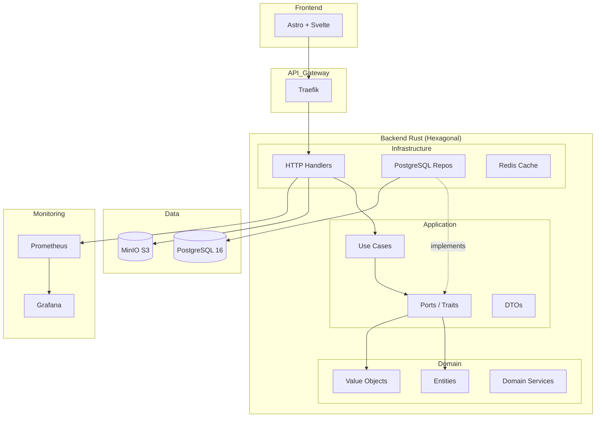
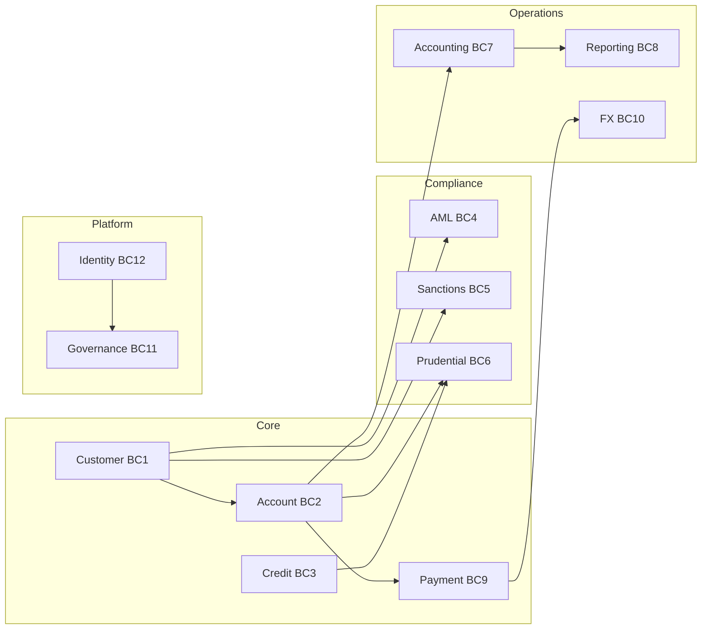
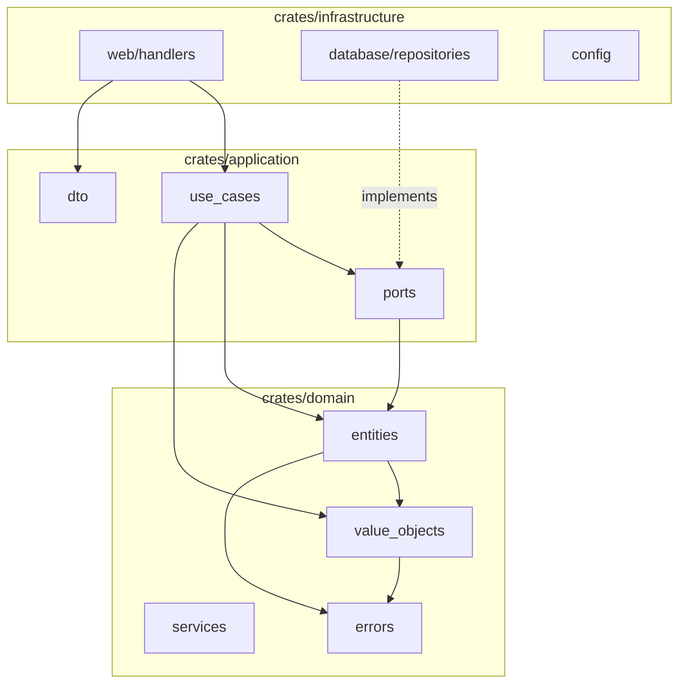
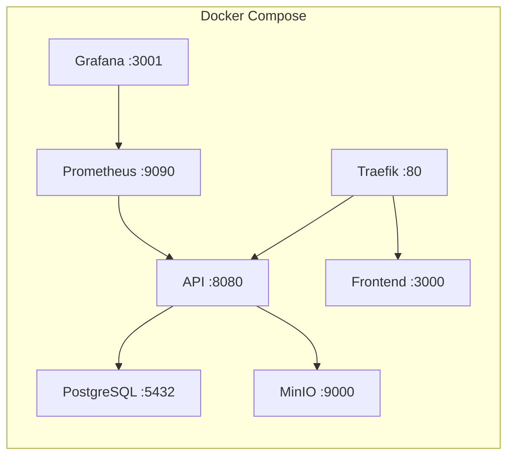

# Architecture BANKO

## Vue d'ensemble

BANKO suit une architecture **hexagonale** (Ports & Adaptateurs) avec **Domain-Driven Design** (DDD).

### Diagramme systeme global

### 12 Bounded Contexts

### Architecture hexagonale par crate

## Stack Docker Compose

## Workspace Cargo

| Crate | Dependencies externes | Role |
|-------|----------------------|------|
| `banko-domain` | serde, thiserror, uuid, chrono | Logique metier pure |
| `banko-application` | domain + async-trait | Use cases, ports |
| `banko-infrastructure` | application + domain + actix-web + sqlx + tokio + tracing | Adaptateurs |
